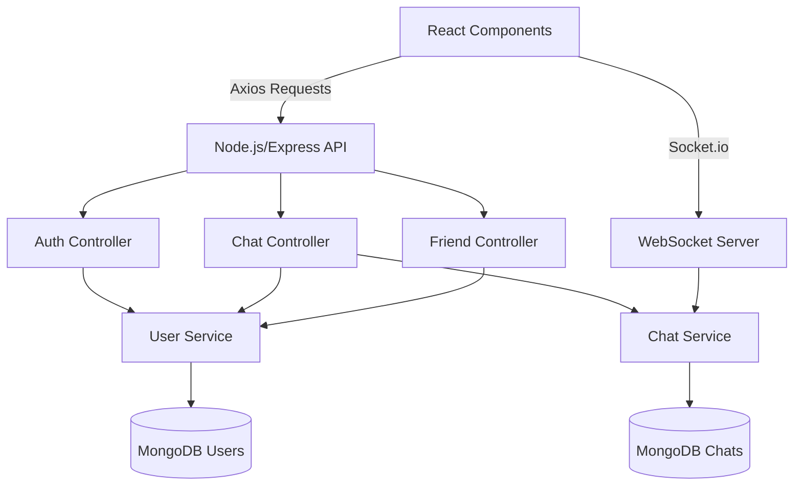
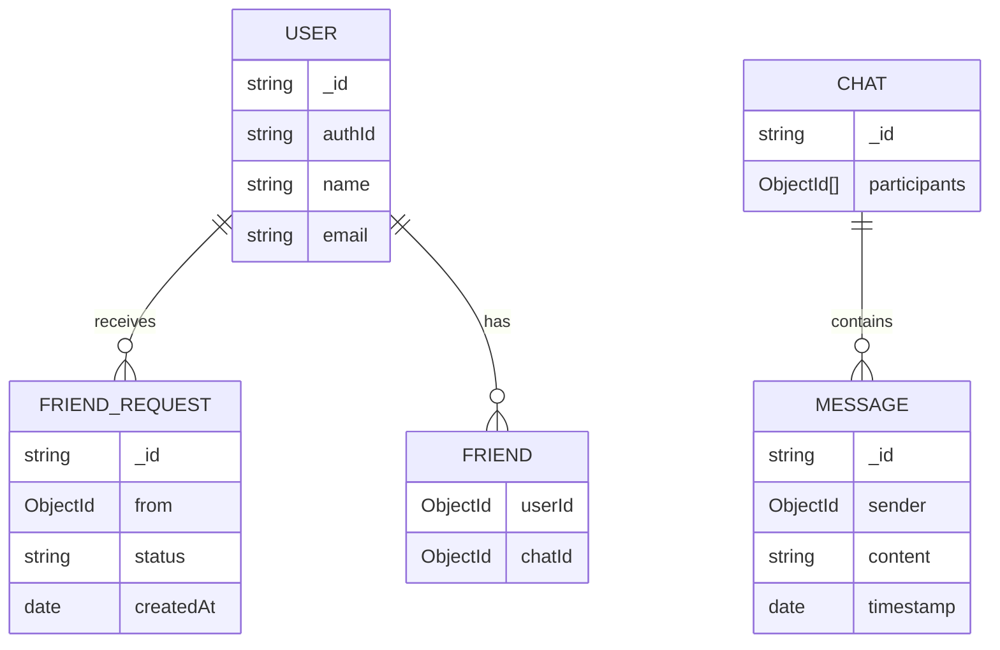
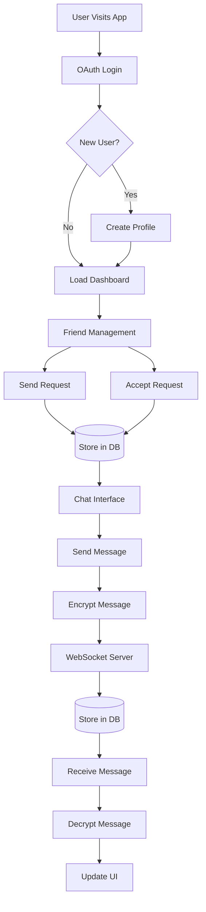
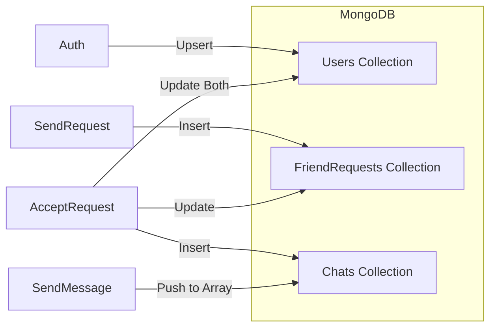
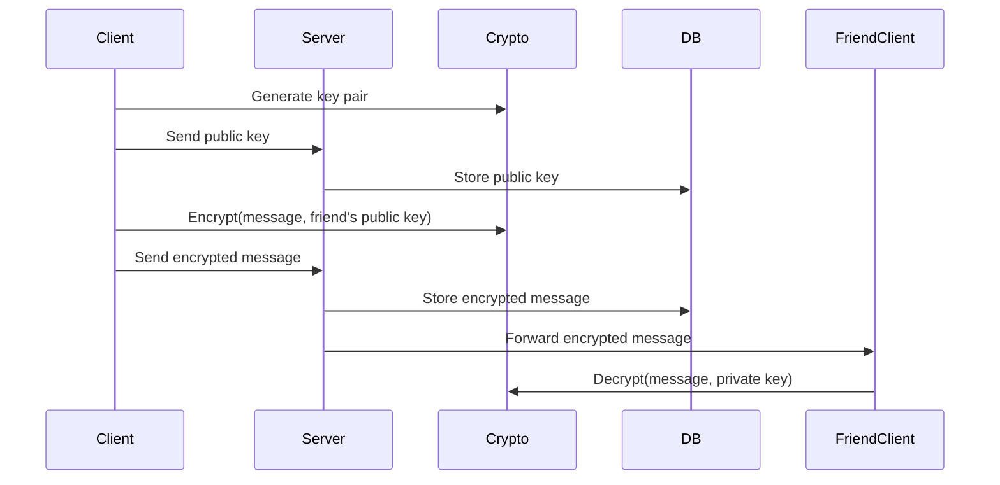
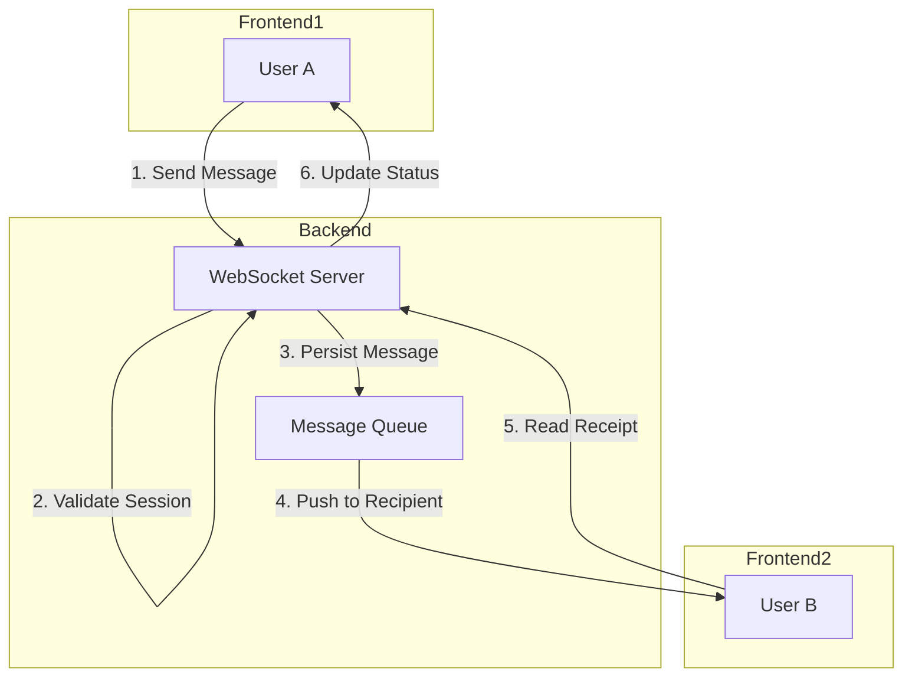

# FriendChat - Secure Friend-to-Friend Messaging App

## 📌 Overview

FriendChat is a secure messaging application that allows users to connect with friends through an invitation system and exchange messages in real-time. The app features OAuth authentication, friend request management, and end-to-end encrypted messaging.

## 🌐 System Architecture


### Component Diagram


---

# 🔄 Workflow: From Invitation to Messaging

- Invitation Phase

    - User A sends friend request to User B via email

    -  System stores pending request in database

    -    User B receives notification

- Acceptance Phase

    - User B accepts request

    -    System creates chat room

     -   Both users are added to each other's friend lists

- Messaging Phase

    -   Either user can initiate chat

    -    Messages are encrypted end-to-end

    -   Real-time updates via WebSocket


# 🛠️ Technical Stack
## Frontend

* React.js

*   WebSocket API

*    CryptoJS (for encryption)

*    DOMPurify (for XSS protection)

## Backend

*    Node.js

*    Express.js

*    Mongoose (MongoDB ODM)

*    JSON Web Tokens (JWT)

*    Passport.js (OAuth)

## Database

- MongoDB with collections:

    -  users (user profiles and friend lists)

    -    chats (chat rooms and messages)

    -   friend_requests (pending invitations)

---
# Project Structure

```
friendchat/
├── client/                  # React frontend
│   ├── public/
│   ├── src/
│   │   ├── components/
│   │   │   ├── Auth/       # Authentication components
│   │   │   ├── Chat/       # Chat UI components
│   │   │   ├── Friends/    # Friend management
│   │   │   └── Layout/     # General layout
│   │   ├── context/        # React contexts
│   │   ├── hooks/          # Custom hooks
│   │   ├── services/       # API services
│   │   └── utils/          # Utility functions
│   └── package.json
│
├── server/                  # Node.js backend
│   ├── config/             # Configuration files
│   ├── controllers/        # Route controllers
│   ├── middleware/         # Custom middleware
│   ├── models/             # Mongoose models
│   ├── routes/             # API routes
│   ├── services/           # Business logic
│   ├── utils/              # Utility functions
│   └── app.js              # Main server file
│
├── .env.example            # Environment variables template
└── README.md               # This file
```
---
# 🔒 Security Features

* Authentication

    -  OAuth 2.0 with Google/Facebook

    -    JWT token-based sessions

     -   Passwordless authentication

* Data Protection

     -   End-to-end message encryption

     -   Secure WebSocket connections (wss://)

    -  Message content sanitization

*    Privacy Controls

        - Friend approval system

      -  Message history controls

     -   Report/block functionality


---
# 🤝 Friend Relationship Model




---
## 🌐 Complete Application Workflow

---
# 🗃️ Database Operations Flow

---
# 🔒 Security Flow


---
# 📱 Real-time Update Flow

